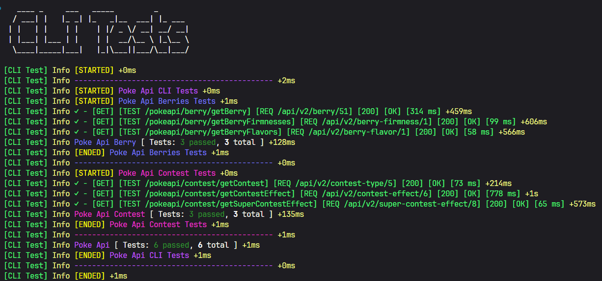

## Description

This project is to test the endpoints in production of another API. In this case testing the PokeAPI.

Libraries used: structure in NestJS, requests with Axios, randomize data with Faker, logs with Winston, colors with Chalk, ascii text with Figlet

## Installation

```bash
$ npm install
```

## Testing with Scripts

```bash
# windows
$ ./scripts/run-cli.ps1

# linux
$ ./scripts/run-cli.sh

```

## Testing in Terminal

```bash
# Necessary in the first time or for every change
$ npm run build

# windows
$ npx tests-cli run

# linux
# Only necessary in the first time or when changing
$ chmod +x ./dist/main.js

$ npx tests-cli run

```

## Options

- Delay: (ms) between tests
   - Default: 2000 ms
   - Flag '-d'
- Frequency: How many times will the test be performed on a single command
   - Default: 1 time
   - Flag '-f'
- Test Cases: Choose which tests will be performed based on the test route
  - /pokeapi/berry: It will only run the tests of berries
  - Default: All tests
  - Flag: '-tc'
- Verbose: Which logs will be more detailed in the output.
  - Flag: '-v'
  - 0: Only error/Default;
  - 1: Only info;
  - 2: All;
  - 3: Never log/Only result

## Example of Output


